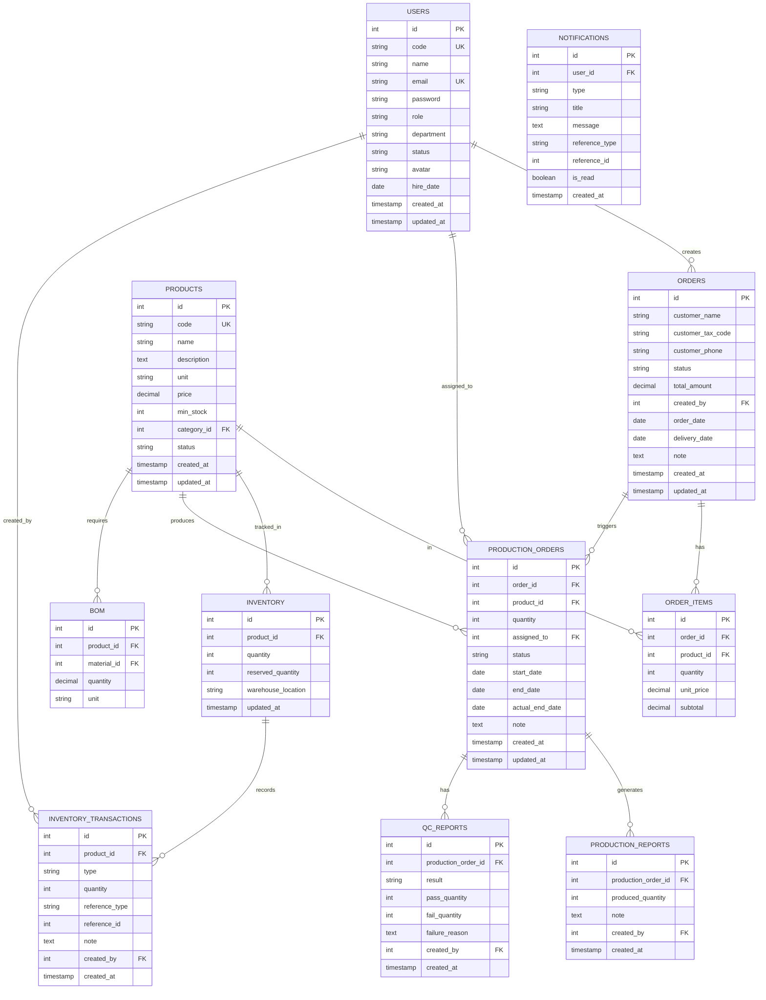

# 📄 SYSTEM SPECIFICATION — ERP NỘI BỘ
## Hệ thống Quản lý Sản xuất – Bán hàng – Kho

---

> **Phiên bản:** 2.0  
> **Cập nhật:** 2025  
> **Trạng thái:** Draft → Review  
> **Ngôn ngữ:** Vietnamese (vi-VN)

---

## MỤC LỤC

1. [Tổng quan hệ thống](#1-tổng-quan-hệ-thống)
2. [Kiến trúc hệ thống](#2-kiến-trúc-hệ-thống)
3. [Module Thông báo](#3-module-thông-báo)
4. [Module Sản phẩm](#4-module-sản-phẩm)
5. [Module Bán hàng](#5-module-bán-hàng)
6. [Module Sản xuất](#6-module-sản-xuất)
7. [Module Kho](#7-module-kho)
8. [Module Nhân sự & Phân quyền](#8-module-nhân-sự--phân-quyền)
9. [Business Logic & Luồng dữ liệu](#9-business-logic--luồng-dữ-liệu)
10. [Database Design (ERD)](#10-database-design-erd)
11. [API Design](#11-api-design)
12. [UI/UX Design Spec](#12-uiux-design-spec)
13. [Tech Stack & Kiến trúc triển khai](#13-tech-stack--kiến-trúc-triển-khai)
14. [Bảo mật & Phân quyền (RBAC)](#14-bảo-mật--phân-quyền-rbac)
15. [Hiệu năng & Khả năng mở rộng](#15-hiệu-năng--khả-năng-mở-rộng)
16. [Lộ trình phát triển](#16-lộ-trình-phát-triển)

---

## 1. TỔNG QUAN HỆ THỐNG

### 1.1 Giới thiệu

Hệ thống ERP nội bộ là nền tảng quản lý tích hợp phục vụ toàn bộ hoạt động vận hành của doanh nghiệp sản xuất, bao gồm: quản lý đơn hàng, điều phối sản xuất, kiểm soát kho, và theo dõi hiệu suất nhân viên.

### 1.2 Phạm vi hệ thống

| Phân hệ | Mô tả | Người dùng chính |
|---|---|---|
| Thông báo & Nội quy | Truyền thông nội bộ, lịch làm việc | Tất cả |
| Sản phẩm | Quản lý danh mục sản phẩm, BOM | Admin, Kho |
| Bán hàng | Đặt hàng, theo dõi đơn, doanh thu | Sales |
| Sản xuất | Lệnh sản xuất, QC, báo cáo | Sản xuất |
| Kho | Nhập/xuất kho, tồn kho realtime | Thủ kho |
| Nhân sự | Hồ sơ NV, KPI, phân quyền | Admin, HR |

### 1.3 Mục tiêu hệ thống

- **Đồng bộ dữ liệu:** Kết nối liền mạch giữa Sales → Sản xuất → Kho → Doanh thu
- **Tự động hóa:** Giảm tối đa thao tác thủ công qua tự động kích hoạt lệnh sản xuất và trừ tồn kho
- **Theo dõi realtime:** Hiển thị tồn kho, trạng thái đơn hàng, tiến độ sản xuất theo thời gian thực
- **Hiệu suất nhân viên:** Ghi nhận KPI, hoạt động cá nhân, cộng/trừ doanh thu theo user

### 1.4 Các bên liên quan (Stakeholders)

| Vai trò | Trách nhiệm |
|---|---|
| Admin | Toàn quyền hệ thống, quản lý user |
| Sales | Tạo và theo dõi đơn hàng |
| Sản xuất | Xử lý lệnh sản xuất, báo cáo QC |
| Thủ kho | Nhập/xuất kho, kiểm tra tồn |
| HR | Quản lý hồ sơ nhân viên |
| Viewer | Xem báo cáo, không chỉnh sửa |

---

## 2. KIẾN TRÚC HỆ THỐNG

### 2.1 Kiến trúc tổng thể (High-Level Architecture)

```
┌─────────────────────────────────────────────────────────┐
│                     CLIENT LAYER                         │
│   [Web App - Livewire 3 SPA]  [Mobile App - Future]        │
└──────────────────────┬──────────────────────────────────┘
                       │ HTTPS / WebSocket
┌──────────────────────▼──────────────────────────────────┐
│                   API GATEWAY / NGINX                     │
│          Load Balancer + Rate Limiting + SSL              │
└──────────────────────┬──────────────────────────────────┘
                       │
┌──────────────────────▼──────────────────────────────────┐
│                  APPLICATION LAYER                        │
│  ┌─────────────┐  ┌──────────────┐  ┌────────────────┐  │
│  │  REST API   │  │  WebSocket   │  │  Queue Worker  │  │
│  │  (Laravel)  │  │  (Reverb /   │  │  (Jobs/Events) │  │
│  │             │  │   Pusher)    │  │                │  │
│  └─────────────┘  └──────────────┘  └────────────────┘  │
└──────────────────────┬──────────────────────────────────┘
                       │
┌──────────────────────▼──────────────────────────────────┐
│                    DATA LAYER                             │
│  ┌──────────────┐  ┌───────────┐  ┌──────────────────┐  │
│  │  MySQL 8.0   │  │   Redis   │  │  File Storage    │  │
│  │  (Primary)   │  │  (Cache / │  │  (S3 / Local)    │  │
│  │              │  │  Session/ │  │                  │  │
│  │              │  │  Queue)   │  │                  │  │
│  └──────────────┘  └───────────┘  └──────────────────┘  │
└─────────────────────────────────────────────────────────┘
```

### 2.2 Nguyên tắc thiết kế

- **Separation of Concerns:** Mỗi module độc lập, giao tiếp qua Service/Event
- **Single Source of Truth:** Dữ liệu kho, đơn hàng luôn được đồng bộ qua transaction DB
- **Event-Driven:** Thay đổi trạng thái đơn hàng kích hoạt Event, lan truyền sang module liên quan
- **Optimistic UI:** Frontend cập nhật tức thì, rollback nếu API thất bại
- **RBAC:** Mọi endpoint đều kiểm tra quyền theo role

### 2.3 Module Dependency Map

```
Bán hàng ──────→ Kho (trừ tồn kho khi đủ hàng)
Bán hàng ──────→ Sản xuất (tạo lệnh SX khi thiếu hàng)
Sản xuất ──────→ Kho (nhập kho khi hoàn thành)
Kho ───────────→ Thông báo (cảnh báo tồn thấp)
Sản xuất ──────→ Thông báo (cập nhật tiến độ)
Nhân sự ───────→ Bán hàng (gán doanh thu theo user)
```

---

## 3. MODULE THÔNG BÁO

### 3.1 Chức năng

| Tính năng | Mô tả | Quyền |
|---|---|---|
| Xem nội quy | Hiển thị danh sách quy định công ty | Tất cả |
| Lịch làm việc | Gantt chart theo tuần/tháng | Tất cả |
| Form xin nghỉ | Gửi yêu cầu nghỉ phép có phê duyệt | Tất cả |
| Thông báo hệ thống | Cảnh báo tồn kho thấp, đơn hàng mới | Theo role |
| Push notification | Badge đỏ realtime qua WebSocket | Tất cả |

### 3.2 Notification Types

| Loại | Trigger | Màu Badge |
|---|---|---|
| `order.new` | Đơn hàng mới được tạo | 🔵 Xanh |
| `order.status_changed` | Trạng thái đơn thay đổi | 🟡 Vàng |
| `inventory.low` | Tồn kho dưới ngưỡng tối thiểu | 🔴 Đỏ |
| `production.completed` | Lệnh sản xuất hoàn thành | 🟢 Xanh lá |
| `qc.failed` | Sản phẩm không qua QC | 🔴 Đỏ |
| `leave.approved` | Đơn xin nghỉ được duyệt | 🟢 Xanh lá |

### 3.3 Luồng xử lý Notification

```
Event phát sinh → EventListener → NotificationService
    → Push to Redis Queue
    → WebSocket broadcast đến user(s) liên quan
    → Lưu DB (notifications table)
    → Frontend nhận, cập nhật badge count
```

---

## 4. MODULE SẢN PHẨM

### 4.1 Thông tin sản phẩm

| Trường | Kiểu | Bắt buộc | Mô tả |
|---|---|---|---|
| `id` | INT (PK) | ✅ | Auto increment |
| `code` | VARCHAR(50) | ✅ | Mã sản phẩm, unique |
| `name` | VARCHAR(255) | ✅ | Tên sản phẩm |
| `description` | TEXT | | Mô tả chi tiết |
| `unit` | VARCHAR(20) | ✅ | Đơn vị: cái, kg, m, hộp... |
| `price` | DECIMAL(15,2) | ✅ | Giá bán |
| `min_stock` | INT | ✅ | Tồn kho tối thiểu (ngưỡng cảnh báo) |
| `category_id` | INT (FK) | | Danh mục sản phẩm |
| `status` | ENUM | ✅ | `active` / `inactive` |
| `created_at` | TIMESTAMP | ✅ | |
| `updated_at` | TIMESTAMP | ✅ | |

### 4.2 BOM — Bill of Materials (Nguyên vật liệu)

Mỗi sản phẩm có thể có danh sách NVL cần thiết để sản xuất:

| Trường | Kiểu | Mô tả |
|---|---|---|
| `product_id` | INT (FK) | Sản phẩm thành phẩm |
| `material_id` | INT (FK) | Nguyên vật liệu |
| `quantity` | DECIMAL | Số lượng NVL / 1 đơn vị SP |
| `unit` | VARCHAR | Đơn vị NVL |

### 4.3 Business Rules

- Mã sản phẩm (`code`) phải duy nhất trong toàn hệ thống
- Sản phẩm `inactive` không xuất hiện trong form đặt hàng
- Khi `tồn kho < min_stock` → tự động gửi notification cảnh báo
- Không được xóa sản phẩm đã có lịch sử đơn hàng (soft delete)

---

## 5. MODULE BÁN HÀNG

### 5.1 Form đặt hàng

| Trường | Kiểu | Bắt buộc | Ghi chú |
|---|---|---|---|
| `customer_name` | VARCHAR(255) | ✅ | Tên khách hàng |
| `customer_tax_code` | VARCHAR(20) | | Mã số thuế (MST) |
| `customer_phone` | VARCHAR(15) | | |
| `customer_address` | TEXT | | |
| `order_date` | DATE | ✅ | Ngày đặt hàng |
| `delivery_date` | DATE | | Ngày giao hàng dự kiến |
| `note` | TEXT | | Ghi chú đơn hàng |
| `created_by` | INT (FK → users) | ✅ | Nhân viên tạo đơn |
| `status` | ENUM | ✅ | Xem bảng trạng thái |

**Chi tiết đơn hàng (Order Items):**

| Trường | Kiểu | Bắt buộc |
|---|---|---|
| `product_id` | INT (FK) | ✅ |
| `quantity` | INT | ✅ |
| `unit_price` | DECIMAL(15,2) | ✅ |
| `subtotal` | DECIMAL(15,2) | ✅ (tính tự động) |

### 5.2 Trạng thái đơn hàng

```
[PENDING] → [CONFIRMED] → [IN_PRODUCTION] → [READY] → [DELIVERED] → [COMPLETED]
                                                                            ↑
                   [CANCELLED] ←──────────────────────────────────────────┘
                             (có thể hủy từ bất kỳ giai đoạn nào trước DELIVERED)
```

| Trạng thái | Màu hiển thị | Mô tả |
|---|---|---|
| `PENDING` | 🟡 Vàng | Vừa tạo, chờ xác nhận |
| `CONFIRMED` | 🔵 Xanh dương | Đã xác nhận, kiểm tra kho |
| `IN_PRODUCTION` | 🟠 Cam | Đang sản xuất |
| `READY` | 🟢 Xanh lá | Hàng sẵn sàng, chờ giao |
| `DELIVERED` | 🟢 Xanh đậm | Đã giao hàng |
| `COMPLETED` | ⚫ Xám | Hoàn tất, đã thanh toán |
| `CANCELLED` | 🔴 Đỏ | Đã hủy |

### 5.3 Business Logic — Xử lý đơn hàng

```
Tạo đơn hàng
    │
    ▼
Kiểm tra tồn kho (inventory check)
    │
    ├─── Đủ hàng ──────────────────→ Reserve inventory (trừ kho)
    │                                  Status: CONFIRMED → READY
    │
    └─── Thiếu hàng ───────────────→ Tạo Production Order tự động
                                       Status: CONFIRMED → IN_PRODUCTION
                                       Notification cho bộ phận SX
                                       Khi SX xong → nhập kho → Status: READY
```

### 5.4 Doanh thu nhân viên

- Mỗi đơn hàng hoàn thành (`COMPLETED`) cộng vào doanh thu của `created_by`
- Doanh thu được tính theo: `SUM(order_items.subtotal)` của đơn hàng user tạo
- Có thể xem trên Dashboard cá nhân và báo cáo Admin

---

## 6. MODULE SẢN XUẤT

### 6.1 Luồng sản xuất

```
Đặt hàng / Yêu cầu SX
        │
        ▼
┌───────────────┐
│  Lệnh SX      │  ← production_orders
│  (Chờ xử lý) │
└───────┬───────┘
        │ Nhân viên SX nhận
        ▼
┌───────────────┐
│  Đang làm     │  ← Đề xuất NVL, xuất kho NVL
│  (In Progress)│
└───────┬───────┘
        │ Hoàn thành sản xuất
        ▼
┌───────────────┐
│  QC           │  ← Kiểm tra chất lượng
│  (Quality     │    Pass → Tiếp tục
│   Control)    │    Fail → Trả về In Progress
└───────┬───────┘
        │ Pass QC
        ▼
┌───────────────┐
│  Hoàn thành   │  ← Nhập kho thành phẩm
│  (Completed)  │    Cập nhật đơn hàng
└───────────────┘
```

### 6.2 Lệnh sản xuất (Production Order)

| Trường | Kiểu | Mô tả |
|---|---|---|
| `id` | INT (PK) | |
| `order_id` | INT (FK) | Đơn hàng liên quan (nếu có) |
| `product_id` | INT (FK) | Sản phẩm cần SX |
| `quantity` | INT | Số lượng cần SX |
| `assigned_to` | INT (FK → users) | Nhân viên SX phụ trách |
| `status` | ENUM | `pending` / `in_progress` / `qc` / `completed` / `failed` |
| `start_date` | DATE | Ngày bắt đầu kế hoạch |
| `end_date` | DATE | Ngày hoàn thành kế hoạch |
| `actual_end_date` | DATE | Ngày hoàn thành thực tế |
| `note` | TEXT | Ghi chú |

### 6.3 Kanban Board — Cột và UX

| Cột | Trạng thái | Hành động cho phép |
|---|---|---|
| Chờ xử lý | `pending` | Nhận → kéo sang "Đang làm" |
| Đang làm | `in_progress` | Báo cáo tiến độ, đề xuất NVL, chuyển QC |
| QC | `qc` | Pass → Hoàn thành / Fail → Trả về |
| Hoàn thành | `completed` | Xem chi tiết, in báo cáo |

**UX Rules:**
- Drag & Drop giữa các cột (chỉ theo luồng cho phép)
- Click card → Drawer chi tiết (không reload trang)
- Card hiển thị: Tên SP, SL, deadline, NV phụ trách, % tiến độ

### 6.4 Đề xuất nguyên vật liệu

Khi bắt đầu lệnh SX, hệ thống tự động:

1. Tra cứu BOM của sản phẩm
2. Tính toán NVL cần thiết theo số lượng
3. Kiểm tra tồn kho NVL
4. Hiển thị danh sách đề xuất xuất kho NVL
5. Nhân viên xác nhận → Xuất kho NVL tự động

### 6.5 Báo cáo sản xuất

| Báo cáo | Nội dung |
|---|---|
| Báo cáo lệnh SX | Ngày, SP, SL, NV, thời gian, trạng thái |
| Báo cáo đóng gói | Số lượng đóng gói, lô hàng, ngày |
| Báo cáo QC | Tỷ lệ pass/fail, nguyên nhân lỗi |
| Năng suất NV | SL lệnh hoàn thành, thời gian trung bình |

---

## 7. MODULE KHO

### 7.1 Nghiệp vụ kho

| Loại giao dịch | Trigger | Ghi chú |
|---|---|---|
| Nhập kho thủ công | Thủ kho nhập | Hàng mua về, trả hàng |
| Nhập kho SX | Hoàn thành lệnh SX | Tự động |
| Xuất kho bán hàng | Đơn hàng xác nhận đủ kho | Tự động (reserve) |
| Xuất kho NVL | Bắt đầu sản xuất | Thủ công sau khi đề xuất |
| Điều chỉnh kho | Admin/Thủ kho | Kiểm kê, sai lệch |

### 7.2 Inventory Record (Tồn kho)

| Trường | Kiểu | Mô tả |
|---|---|---|
| `product_id` | INT (FK) | |
| `quantity` | INT | Số lượng hiện tại |
| `reserved_quantity` | INT | Đã giữ chỗ cho đơn hàng |
| `available_quantity` | INT (computed) | = quantity - reserved_quantity |
| `warehouse_location` | VARCHAR | Vị trí trong kho |
| `updated_at` | TIMESTAMP | |

### 7.3 Inventory Transaction Log

Mọi thay đổi tồn kho đều được ghi log:

| Trường | Kiểu | Mô tả |
|---|---|---|
| `id` | INT (PK) | |
| `product_id` | INT (FK) | |
| `type` | ENUM | `import` / `export` / `adjust` / `reserve` / `release` |
| `quantity` | INT | Số lượng thay đổi (+ hoặc -) |
| `reference_type` | VARCHAR | `order` / `production_order` / `manual` |
| `reference_id` | INT | ID của đơn hàng / lệnh SX |
| `note` | TEXT | |
| `created_by` | INT (FK → users) | |
| `created_at` | TIMESTAMP | |

### 7.4 Trạng thái tồn kho (Màu sắc)

| Mức | Điều kiện | Màu | Hành động |
|---|---|---|---|
| Đủ hàng | `available >= min_stock * 1.5` | 🟢 Xanh lá | — |
| Cảnh báo | `min_stock <= available < min_stock * 1.5` | 🟡 Vàng | Notification |
| Thiếu hàng | `available < min_stock` | 🔴 Đỏ | Notification + block xuất kho |

### 7.5 Timeline nhập/xuất

- Hiển thị lịch sử giao dịch kho theo timeline
- Filter theo: sản phẩm, loại giao dịch, thời gian, nhân viên
- Export Excel

---

## 8. MODULE NHÂN SỰ & PHÂN QUYỀN

### 8.1 Thông tin nhân viên

| Trường | Kiểu | Mô tả |
|---|---|---|
| `id` | INT (PK) | |
| `code` | VARCHAR(20) | Mã nhân viên (unique) |
| `name` | VARCHAR(255) | Họ tên |
| `email` | VARCHAR(255) | Email đăng nhập (unique) |
| `phone` | VARCHAR(15) | |
| `avatar` | VARCHAR | URL ảnh đại diện |
| `department` | VARCHAR(100) | Phòng ban |
| `role` | ENUM | Xem bảng role |
| `status` | ENUM | `active` / `inactive` / `on_leave` |
| `hire_date` | DATE | Ngày vào làm |
| `created_at` | TIMESTAMP | |

### 8.2 Hệ thống phân quyền (RBAC)

| Role | Modules | Quyền |
|---|---|---|
| `admin` | Tất cả | CRUD + Settings + User Management |
| `sales` | Bán hàng, Sản phẩm (view), Kho (view), Thông báo | Tạo/sửa đơn hàng |
| `production` | Sản xuất, Kho (partial), Thông báo | Quản lý lệnh SX |
| `warehouse` | Kho, Sản phẩm (view), Thông báo | Nhập/xuất kho |
| `hr` | Nhân sự, Thông báo | Quản lý NV |
| `viewer` | Dashboard, Báo cáo (read-only) | Chỉ xem |

### 8.3 Permission Matrix chi tiết

| Resource | Admin | Sales | Production | Warehouse | HR | Viewer |
|---|---|---|---|---|---|---|
| Orders - Create | ✅ | ✅ | ❌ | ❌ | ❌ | ❌ |
| Orders - Edit | ✅ | ✅ (own) | ❌ | ❌ | ❌ | ❌ |
| Orders - View | ✅ | ✅ | ✅ | ✅ | ❌ | ✅ |
| Production - Manage | ✅ | ❌ | ✅ | ❌ | ❌ | ❌ |
| Inventory - Import | ✅ | ❌ | ❌ | ✅ | ❌ | ❌ |
| Inventory - Export | ✅ | ❌ | ✅ (NVL) | ✅ | ❌ | ❌ |
| Inventory - Adjust | ✅ | ❌ | ❌ | ✅ | ❌ | ❌ |
| Users - Manage | ✅ | ❌ | ❌ | ❌ | ✅ | ❌ |
| Reports - View | ✅ | ✅ (own) | ✅ | ✅ | ✅ | ✅ |

### 8.4 KPI nhân viên

| KPI | Sales | Production | Warehouse |
|---|---|---|---|
| Doanh thu | Tổng đơn hoàn thành | — | — |
| Số đơn | Số đơn tạo / tháng | — | — |
| Lệnh SX hoàn thành | — | Số lệnh / tháng | — |
| Tỷ lệ QC Pass | — | % Pass QC | — |
| Giao dịch kho | — | — | Số lần nhập/xuất |

---

## 9. BUSINESS LOGIC & LUỒNG DỮ LIỆU

### 9.1 Luồng hoàn chỉnh: Đặt hàng → Giao hàng

```
1. Sales tạo đơn hàng
        │
        ▼
2. Hệ hệ thống kiểm tra available_quantity
        │
        ├── Đủ hàng → 3a. Reserve inventory → Status: READY
        │
        └── Thiếu → 3b. Tạo Production Order → Notify SX
                             │
                             ▼
                    4. SX thực hiện lệnh → QC → Complete
                             │
                             ▼
                    5. Nhập kho thành phẩm
                             │
                             ▼
6. Cập nhật trạng thái đơn: READY → Notify Sales
        │
        ▼
7. Giao hàng → Status: DELIVERED
        │
        ▼
8. Thanh toán → Status: COMPLETED
        │
        ▼
9. Cộng doanh thu vào account Sales
```

### 9.2 Transaction Safety

Tất cả các thao tác sau phải thực hiện trong **DB Transaction**:

- Tạo đơn hàng + reserve inventory
- Hoàn thành lệnh SX + nhập kho + cập nhật đơn hàng
- Xuất kho NVL + cập nhật production order

### 9.3 Concurrency Control

- Sử dụng **Pessimistic Locking** (`SELECT ... FOR UPDATE`) khi cập nhật tồn kho
- Tránh race condition khi nhiều sales tạo đơn cùng lúc với cùng sản phẩm

---

## 10. DATABASE DESIGN (ERD)

### 10.1 ERD Diagram



### 10.2 Indexes quan trọng

```sql
-- Orders
CREATE INDEX idx_orders_status ON orders(status);
CREATE INDEX idx_orders_created_by ON orders(created_by);
CREATE INDEX idx_orders_order_date ON orders(order_date);

-- Inventory
CREATE UNIQUE INDEX idx_inventory_product ON inventory(product_id);

-- Inventory Transactions
CREATE INDEX idx_inv_trans_product ON inventory_transactions(product_id, created_at);
CREATE INDEX idx_inv_trans_reference ON inventory_transactions(reference_type, reference_id);

-- Production Orders
CREATE INDEX idx_prod_order_status ON production_orders(status);
CREATE INDEX idx_prod_order_assigned ON production_orders(assigned_to);

-- Notifications
CREATE INDEX idx_notifications_user_unread ON notifications(user_id, is_read);
```

---

## 11. API DESIGN

### 11.1 Quy ước API

- **Base URL:** `/api/v1`
- **Authentication:** Bearer Token (Laravel Sanctum)
- **Format:** JSON
- **Pagination:** `?page=1&per_page=20`

**Response format chuẩn:**
```json
{
  "success": true,
  "data": { },
  "message": "OK",
  "meta": {
    "page": 1,
    "per_page": 20,
    "total": 100
  }
}
```

**Error format:**
```json
{
  "success": false,
  "message": "Validation failed",
  "errors": {
    "field": ["Error message"]
  }
}
```

### 11.2 Endpoints chính

**Auth:**
```
POST   /api/v1/auth/login
POST   /api/v1/auth/logout
GET    /api/v1/auth/me
POST   /api/v1/auth/refresh
```

**Products:**
```
GET    /api/v1/products
POST   /api/v1/products
GET    /api/v1/products/{id}
PUT    /api/v1/products/{id}
DELETE /api/v1/products/{id}
GET    /api/v1/products/{id}/bom
```

**Orders:**
```
GET    /api/v1/orders
POST   /api/v1/orders
GET    /api/v1/orders/{id}
PUT    /api/v1/orders/{id}
PUT    /api/v1/orders/{id}/status
DELETE /api/v1/orders/{id}
```

**Production:**
```
GET    /api/v1/production-orders
POST   /api/v1/production-orders
GET    /api/v1/production-orders/{id}
PUT    /api/v1/production-orders/{id}/status
POST   /api/v1/production-orders/{id}/qc
POST   /api/v1/production-orders/{id}/report
```

**Inventory:**
```
GET    /api/v1/inventory
GET    /api/v1/inventory/{product_id}
POST   /api/v1/inventory/import
POST   /api/v1/inventory/export
POST   /api/v1/inventory/adjust
GET    /api/v1/inventory/transactions
```

**Users:**
```
GET    /api/v1/users
POST   /api/v1/users
GET    /api/v1/users/{id}
PUT    /api/v1/users/{id}
GET    /api/v1/users/{id}/kpi
```

**Notifications:**
```
GET    /api/v1/notifications
PUT    /api/v1/notifications/{id}/read
PUT    /api/v1/notifications/read-all
```
